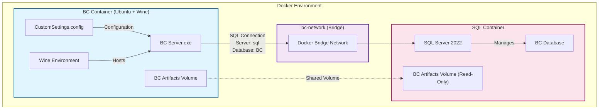
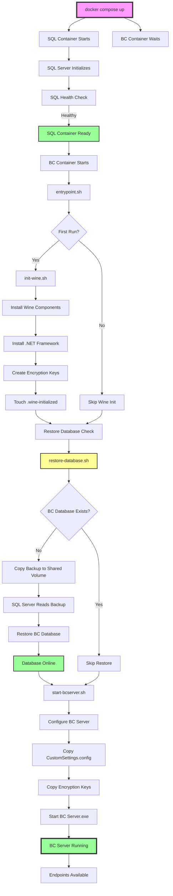
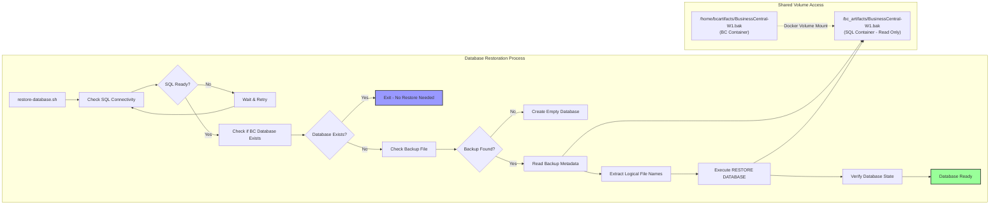
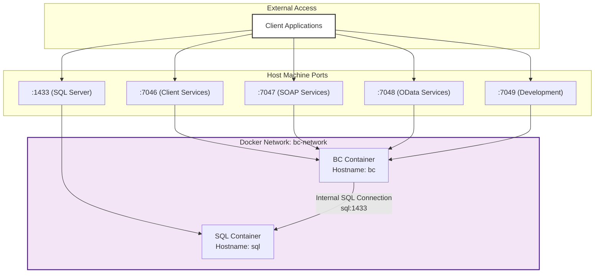

# Business Central with Containerized SQL - Execution Flow

## System Architecture Overview



## Container Startup Sequence with Database Restoration



## Database Restoration Flow Detail



## Network Communication Flow



## Key Configuration Changes

### CustomSettings.config
```xml
<!-- Old Configuration (Host Database) -->
<add key="DatabaseServer" value="192.168.2.99" />
<add key="DatabaseName" value="bc4ubuntu" />

<!-- New Configuration (Containerized SQL) -->
<add key="DatabaseServer" value="sql" />
<add key="DatabaseName" value="BC" />
```

### Docker Compose Volume Configuration
```yaml
sql:
  volumes:
    - sql_data:/var/opt/mssql
    - bc_artifacts:/bc_artifacts:ro  # Added for database restore

bc:
  volumes:
    - bc_artifacts:/home/bcartifacts  # Contains backup file
```

## Critical Components

### 1. **SQL Container Health Check**
- Ensures SQL Server is ready before BC container starts
- Uses sqlcmd to verify connectivity
- Prevents race conditions during startup

### 2. **Database Restoration Script**
- Automatically runs on container startup
- Checks if database exists before attempting restore
- Uses shared volume for backup file access
- Handles both new deployments and container restarts

### 3. **Network Configuration**
- Both containers on same Docker network
- BC container references SQL by hostname "sql"
- No hardcoded IP addresses
- Fully portable solution

### 4. **Wine Custom Build**
- Includes patches for locale/culture issues
- Supports .NET Framework and BC Server
- Multi-stage build for efficiency

## Service Endpoints

| Service | Port | URL | Purpose |
|---------|------|-----|---------|
| OData | 7048 | http://localhost:7048/BC/OData | Data API |
| SOAP | 7047 | http://localhost:7047/BC/WS/ | Web Services |
| Development | 7049 | http://localhost:7049/BC/dev/ | Development Endpoint |
| Client Services | 7046 | - | Windows Client Connection |
| SQL Server | 1433 | localhost:1433 | Direct SQL Access |

## Troubleshooting Connection Points

1. **BC to SQL Connection**
   - Check: `docker exec bcdevonlinux-bc-1 /opt/mssql-tools18/bin/sqlcmd -S sql -U sa -P P@ssw0rd123! -Q "SELECT 1" -C`
   - Verify network: `docker network inspect bcdevonlinux_bc-network`

2. **Database Restore Issues**
   - Check backup file: `docker exec bcdevonlinux-bc-1 ls -la /home/bcartifacts/`
   - Check SQL access: `docker exec bcdevonlinux-sql-1 ls -la /bc_artifacts/`
   - Manual restore: `docker exec bcdevonlinux-bc-1 /home/restore-database.sh`

3. **BC Server Status**
   - Check process: `docker exec bcdevonlinux-bc-1 ps aux | grep Nav.Server`
   - View logs: `docker logs bcdevonlinux-bc-1`

## Success Criteria

- ✅ SQL Container healthy
- ✅ BC Container healthy
- ✅ Database restored (3648 tables)
- ✅ BC Server process running
- ✅ All endpoints responding
- ✅ No external dependencies
- ✅ Fully containerized solution