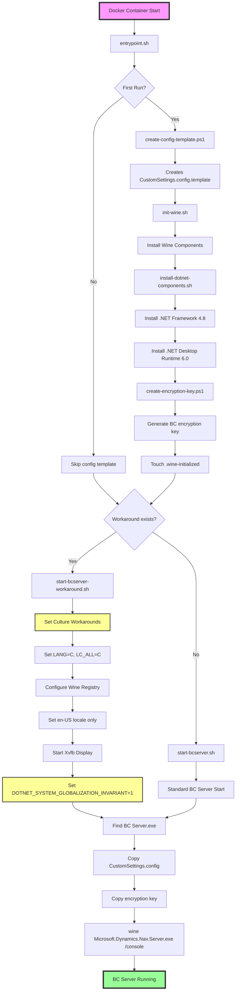

# Business Central Container Execution Flow

## Container Startup Sequence

## Detailed Script Responsibilities

### 1. **entrypoint.sh** (Main Entry Point)
- Sets default environment variables
- Checks for first run
- Delegates to appropriate startup script

### 2. **create-config-template.ps1** (PowerShell)
- Creates BC configuration template
- Sets up database connection strings
- Configures service endpoints

### 3. **init-wine.sh** (Wine Environment Setup)
- Creates Wine prefix
- Installs required Windows components
- Calls component installers

### 4. **install-dotnet-components.sh** (.NET Installation)
- Downloads and installs .NET Framework 4.8
- Downloads and installs .NET Desktop Runtime 6.0
- Handles Wine-specific installation quirks

### 5. **create-encryption-key.ps1** (Security Setup)
- Generates BC encryption key
- Saves key to appropriate location

### 6. **start-bcserver-workaround.sh** (Culture Fix Startup)
- **Critical for Wine compatibility**
- Sets restrictive locale environment:
  - `LANG=C`
  - `LC_ALL=C`
  - `LC_MESSAGES=C`
  - `LC_CTYPE=C`
- Configures Wine registry for single locale (en-US)
- Sets `DOTNET_SYSTEM_GLOBALIZATION_INVARIANT=1`
- Prevents duplicate culture entries (e.g., "Catalan (Spain)")

### 7. **start-bcserver.sh** (Standard Startup)
- Basic BC server startup without culture workarounds
- Used when no culture conflicts expected

## Key Environment Variables

| Variable | Purpose | Default |
|----------|---------|---------|
| `SA_PASSWORD` | SQL Server SA password | `YourPassword123` |
| `WINEPREFIX` | Wine prefix location | `~/.local/share/wineprefixes/bc1` |
| `WINEARCH` | Wine architecture | `win64` |
| `DISPLAY` | X11 display for Wine | `:0` |
| `DOTNET_SYSTEM_GLOBALIZATION_INVARIANT` | Disable culture-specific behavior | `1` (in workaround) |

## Critical Files Created/Modified

1. **CustomSettings.config** - BC server configuration
2. **Secret.key** - BC encryption key
3. **Wine Registry** - Locale settings modified to prevent duplicates
4. **.wine-initialized** - Marker file to skip Wine init on subsequent runs

## Common Failure Points

1. **Culture Duplicate Error** - Resolved by workaround script
2. **Wine Server Crash** - Usually related to locale/culture conflicts
3. **Missing .NET Components** - Requires proper installation sequence
4. **X11 Display Issues** - Xvfb must be running for Wine GUI components